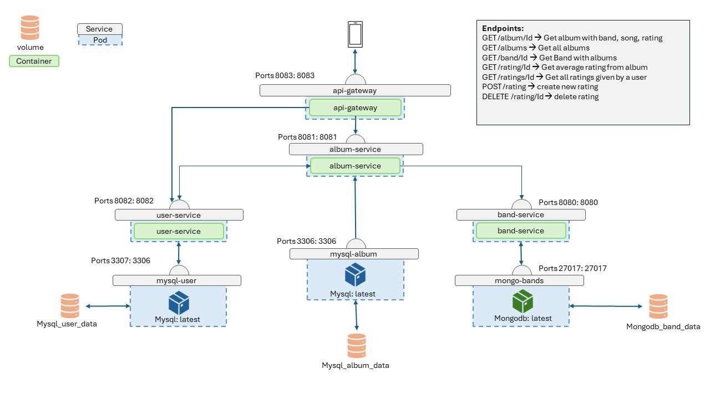
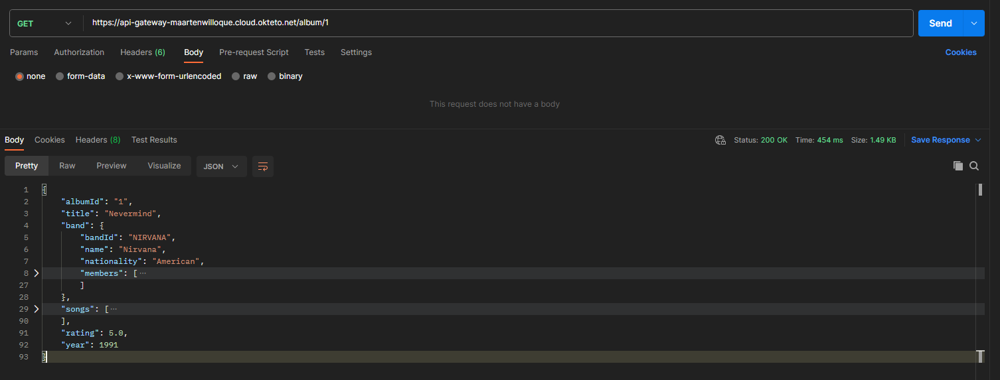
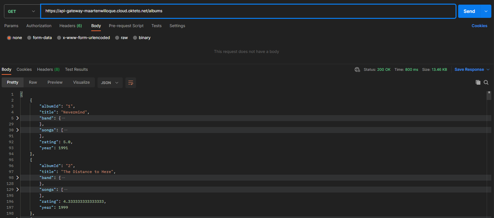
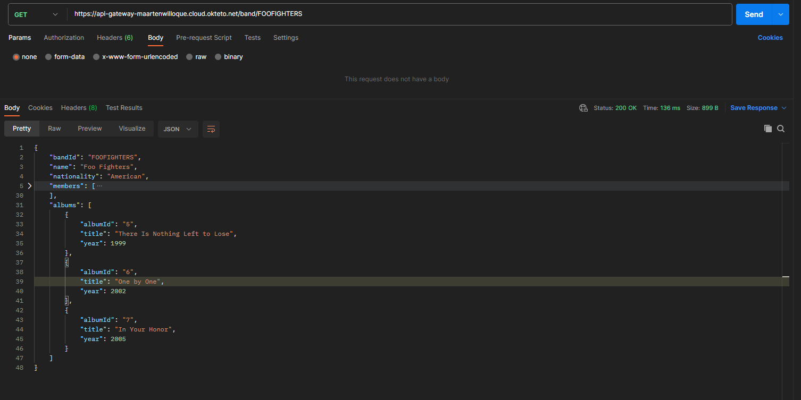
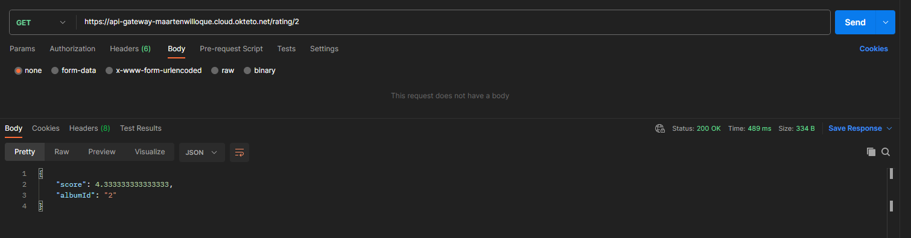
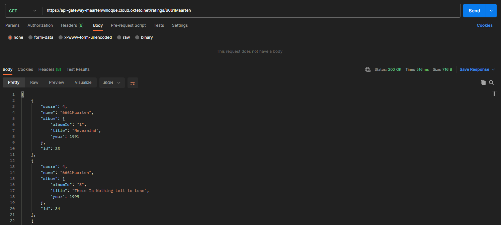
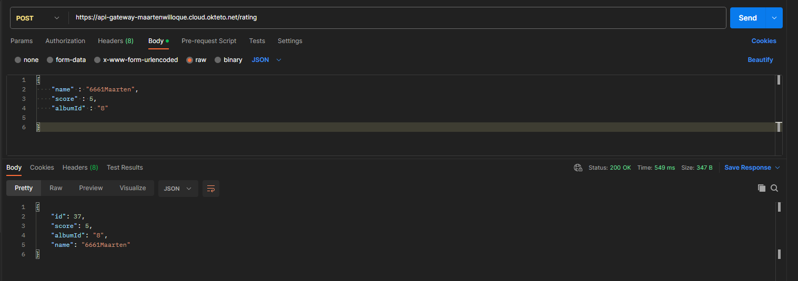
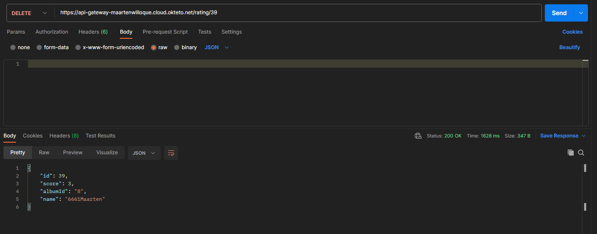

# Project Album-opedia flutter Back-end
## Omschrijving
In de flutter applicatie kan je met behulp van AR albumcovers scannen.
Indien deze herkend wordt, haalt de app de bijhorende informatie op uit de database. 
Het is ook mogelijk om elk album een bepaalde rating te geven. Deze worden per album verzameld
en bij het laden van de detailpagina, wordt steeds de gemiddelde rating getoond. Extra functionaliteit
is er ook voor zien door het ophalen van alle albums van een bepaalde band en een overzicht van alle reeds
door de gebruiker gegeven scores. Hier kunnen scores ook opnieuw verwijderd worden.

Het geheel bestaat uit 7 containers. Voor deze opzet is er gekozen voor 3 databases waarvan 2 Mysql
(User & Album) en 1 Mongodb (Band) database met bijhorende services. Alle communicatie gebeurd via aan 
gateway die 5 GET endpoints, 1 Post en 1 Delete endpoint bevat.

## Opbouw Services

### Services
- [Docker-compose](docker-compose.yml)

### Api-gateway
- [Docker-file](./api-gateway/Dockerfile)
- Ports 8083:8083
- depends on:
  - [User-service](./user-service)
  - [Album-service](./album-service)
  - [Band-service](./band-service)
- [Endpoints](#Api-gateway-endpoints)

### Album-Service
- [Docker-file](./album-service/Dockerfile)
- Ports 8081:8081
- MySQL Database
  - Port 3306: 3306
- Entities: 
  - [Album](./album-service/src/main/java/fact/it/albumservice/model/Album.java)
  - [Song](./album-service/src/main/java/fact/it/albumservice/model/Song.java)
- Depends on:
  - [Band-service](./band-service)
  - [User-service](./user-service)
 
For this service we implemented testing off all methods [Tests](./album-service/src/test/java/fact/it/albumservice/AlbumServiceTest.java)

### Band-Service 
- [Docker-file](./band-service/Dockerfile)
- Ports 8080:8080
- Mongodb Database
  - Port 27017: 27017
- Entities: 
  - [Band](./band-service/src/main/java/fact/it/bandservice/model/Band.java)
  - [BandMember](./band-service/src/main/java/fact/it/bandservice/model/BandMember.java)

### User-Service
- [Docker-file](./user-service/Dockerfile)
- Ports 8082:8082
- MySQL Database
  - Port 3307: 3306
- Entities:
  - [User](./user-service/src/main/java/fact/it/userservice/model/User.java)
  - [Rating](./user-service/src/main/java/fact/it/userservice/model/Rating.java)
- Depends on:
  - [Album-service](./album-service)

## Api-gateway endpoints
### /album/id
- GET
- Returns:
  - album with songs (api/album/albumId) [AlbumController](./album-service/src/main/java/fact/it/albumservice/controller/AlbumController.java)
  - band with bandmembers (/api/band/bandId) [BandController](./band-service/src/main/java/fact/it/bandservice/controller/BandController.java)
  - average rating (/api/rating/average/albumId) [RatingController](./user-service/src/main/java/fact/it/userservice/controller/RatingController.java)

### /albums
- GET
- Returns:
  - all albums with songs (api/albums) [AlbumController](./album-service/src/main/java/fact/it/albumservice/controller/AlbumController.java)
  - band with bandmembers (/api/band/bandId) [BandController](./band-service/src/main/java/fact/it/bandservice/controller/BandController.java)
  - average rating (/api/rating/average/albumId) [RatingController](./user-service/src/main/java/fact/it/userservice/controller/RatingController.java)

### /band/Id
- GET
- Returns:
  - band (api/band/Id) [BandController](./band-service/src/main/java/fact/it/bandservice/controller/BandController.java)
  - all albums of the band (api/band/Id) [AlbumController](./album-service/src/main/java/fact/it/albumservice/controller/AlbumController.java)

### /rating/Id
- GET
- Returns:
  - average rating of an album (/api/rating/average/albumId) [RatingController](./user-service/src/main/java/fact/it/userservice/controller/RatingController.java)

### /ratings/Id
- GET
- Returns:
  - all ratings given by a user (/api/rating/user/userId) [RatingController](./user-service/src/main/java/fact/it/userservice/controller/RatingController.java)
  - album (api/albumDto/Id) [AlbumController](./album-service/src/main/java/fact/it/albumservice/controller/AlbumController.java)

### /rating
- POST
- Returns:
  - New rating (api/rating) [RatingController](./user-service/src/main/java/fact/it/userservice/controller/RatingController.java)

### /rating/Id
- DELETE
- Returns:
  - Deleted Rating (api/rating) [RatingController](./user-service/src/main/java/fact/it/userservice/controller/RatingController.java)

